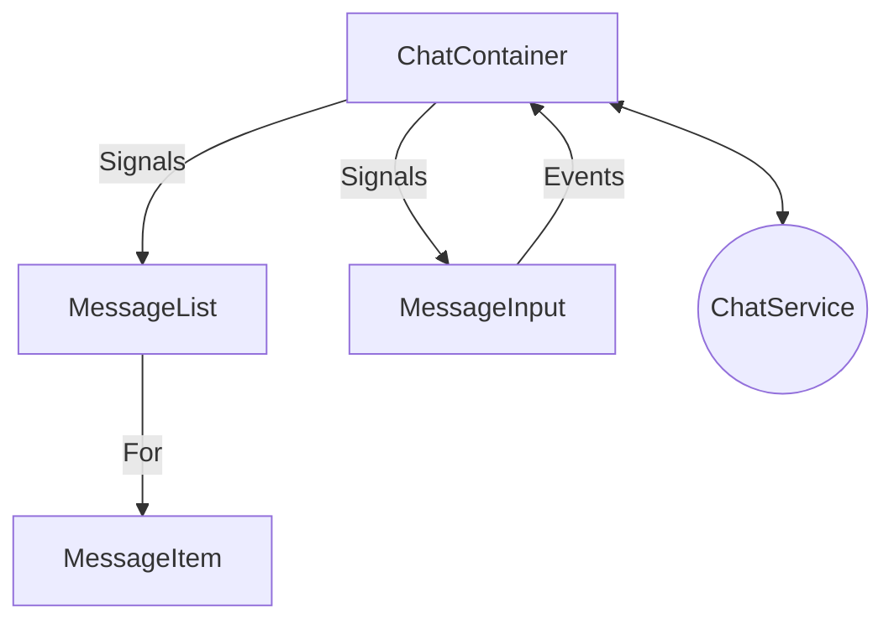
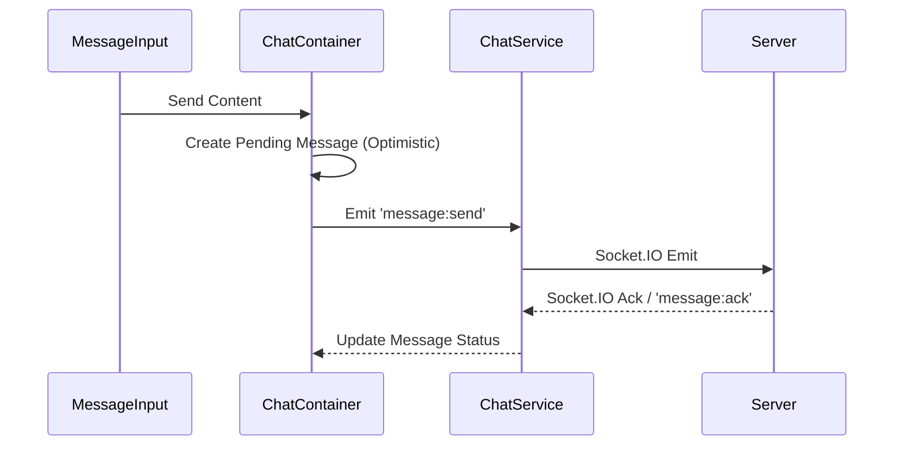
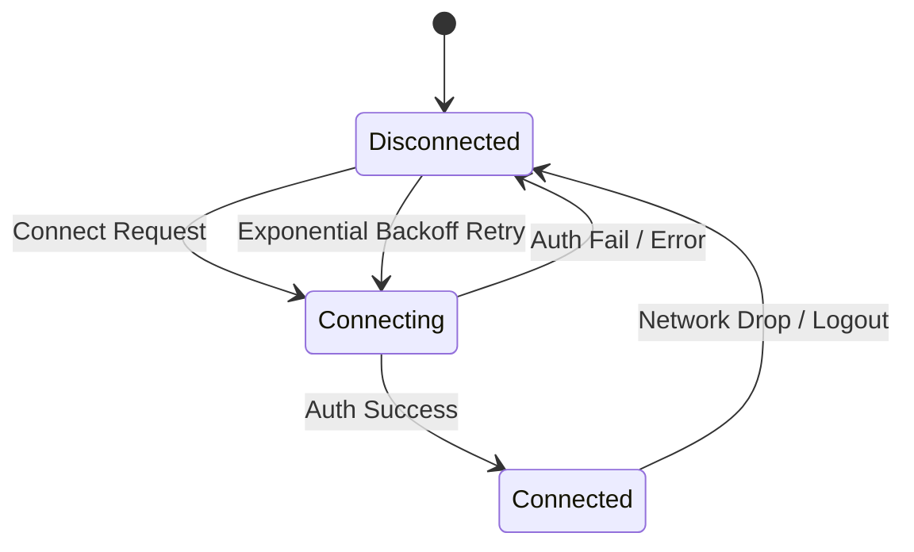

### Architecture Overview

The chat system is built using a unidirectional data flow pattern, leveraging Angular Signals for state management and RxJS for socket event streams.

#### 1. Socket Event Contract

| Event | Direction | Payload | Description |
| :--- | :--- | :--- | :--- |
| `join:room` | Client -> Server | `{ roomId: string }` | Join a specific chat room |
| `leave:room` | Client -> Server | `{ roomId: string }` | Leave a specific chat room |
| `message:send` | Client -> Server | `{ roomId: string, content: string, nonce: string }` | Send a new message |
| `message:receive` | Server -> Client | `Message` | Received a new message |
| `message:ack` | Server -> Client | `{ nonce: string, status: 'delivered' \| 'failed', message?: Message }` | Acknowledgment of a sent message |
| `typing:start` | Client <-> Server | `{ roomId: string, userId: string, username: string }` | User started typing |
| `typing:stop` | Client <-> Server | `{ roomId: string, userId: string }` | User stopped typing |
| `presence:update` | Server -> Client | `{ userId: string, status: 'online' \| 'offline' }` | Presence update |

#### 2. Models

```typescript
export interface Message {
  id: string;
  roomId: string;
  senderId: string;
  senderName: string;
  senderAvatar?: string;
  content: string;
  timestamp: string;
  status: 'pending' | 'delivered' | 'failed';
  nonce?: string; // For optimistic UI matching
}

export interface TypingIndicator {
  userId: string;
  username: string;
  lastActive: number;
}
```

#### 3. Component Interaction Diagram



#### 4. Message Flow (Optimistic UI)



#### 5. Socket Lifecycle


